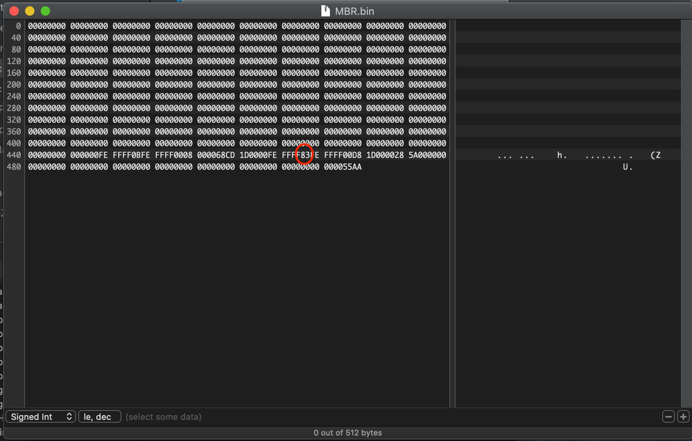

# Building a minimal Linux file system

Lot of valuable information available here:
https://embeddedstudy.home.blog/2019/01/23/building-the-minimal-rootfs-using-busybox/

and here:

https://wiki.beyondlogic.org/index.php?title=Cross_Compiling_BusyBox_for_ARM

## Prerequisites

```
$ brew install gmp
$ brew install zstd
$ brew install bison
$ brew install make
$ brew install gawk
```

To be able to format ext2/ext4 drive

```
$ brew install e2fsprogs
```

and https://github.com/alperakcan/fuse-ext2 a macOS file system extension

## Building a toolchain

A toolchain : an ARM GCC compiler, static and shared libraries and linux header files are required and to build the components of the minimal file system.

* Download binutils-2.37.tar from https://ftp.gnu.org/gnu/binutils/ and extract the archive
* Execute build_binutil.sh
* Download gcc-8.5.0 from https://ftp.gnu.org/gnu/gcc/gcc-8.5.0/ and extract the archive
* Execute build_gcc.sh
* Download glibc-2.34 from https://ftp.gnu.org/gnu/glibc/ and extract the archive
* Execute build_glibc.sh

## Building buzybox
Download buzybox sources

```
$ wget http://busybox.net/downloads/busybox-1.34.1.tar.bz2
```
* Apply a patch to fix a comile error
* Execute build_buzybox.sh

This script builds the busybox executable and populates a minimal Linux file system located in the directory 'rootfs'

## Update the MBR partition

The 'SECOND' partition must be of type Linux. diskutil does not allow to do it. We have to patch the MRB by extracting it from the SD card, edit the content and re-flash it on the sd card

Save the MBR as a file

```
$ diskutil unmountDisk /dev/disk9
$ sudo dd if=/dev/disk9 of=`pwd`/MBR.backup  bs=512 count=1
```
* Open MBR.backup with a file content editor like https://hexfiend.com
* Replace the value with 83, then save.



Flash MBR back to sd card
```
$ sudo dd conv=notrunc bs=512 count=1 if=`pwd`/MBR.backup of=/dev/disk9
```
Create an empty file system image
```
$ dd if=/dev/zero of=`pwd`/rootfs.ext4 bs=1m count=150
```

```
150+0 records in
150+0 records out
157286400 bytes transferred in 0.077430 secs (2031336691 bytes/sec)
```

Format as ext2
```
$ sudo $(brew --prefix e2fsprogs)/sbin/mkfs.ext2 `pwd`/rootfs.ext4 
```
```
mke2fs 1.46.4 (18-Aug-2021)
Creating filesystem with 153600 1k blocks and 38456 inodes
Filesystem UUID: bbeb87f6-e39e-4c21-9bba-147586b59c05
Superblock backups stored on blocks: 
        8193, 24577, 40961, 57345, 73729

Allocating group tables: done                            
Writing inode tables: done                            
Writing superblocks and filesystem accounting information: done
```

Mount the drive
```
$ mkdir `pwd`/sd-card-ext2
$ fuse-ext2  `pwd`/rootfs.ext4 `pwd`/sd-card-ext2 -o rw+,allow_other,uid=501,gid=20
```
Copy rootfs content to mounted ext2 drive

```
$ cp -a `pwd`/rootfs/* `pwd`/sd-card-ext2/
```

* Unmount rootfs.ext4
* Copy content to sd card with 'dd' command

```
$ diskutil unmountDisk /dev/disk9
$ sudo dd if=`pwd`/rootfs.ext4 of=/dev/disk9s2
```

* Insert the SD card into the Lichee Nano
* Connect the 5V wire to the board
* The board will boot up

[Lichee Nano boot](MMC_BOOT_LFS.md)