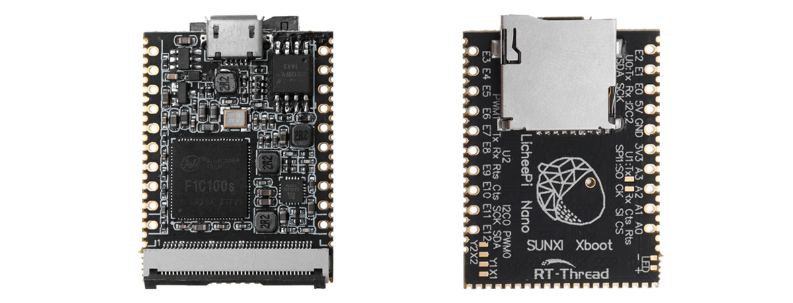
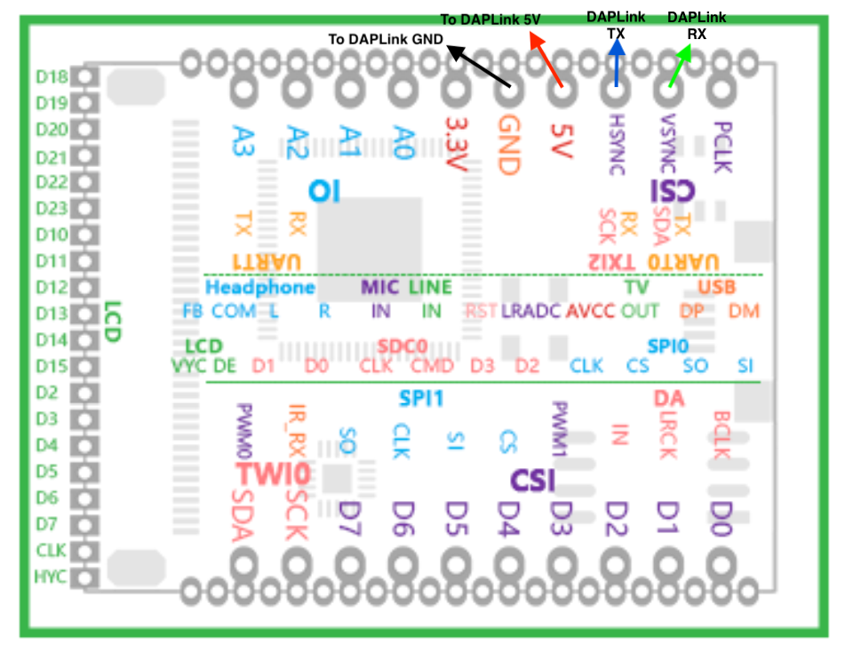
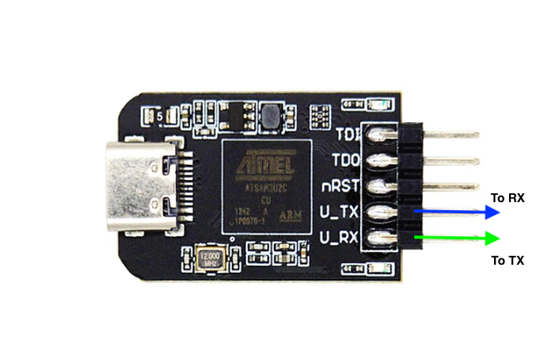
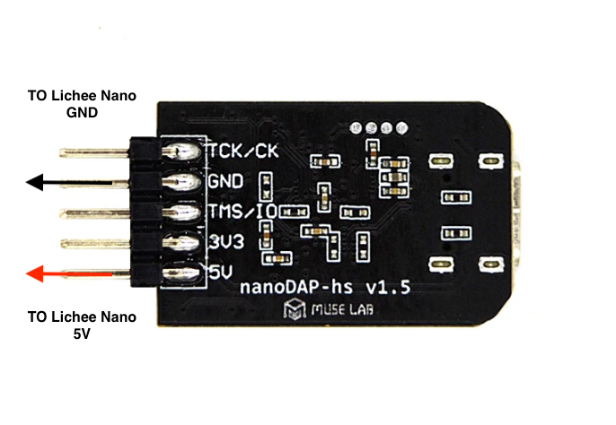
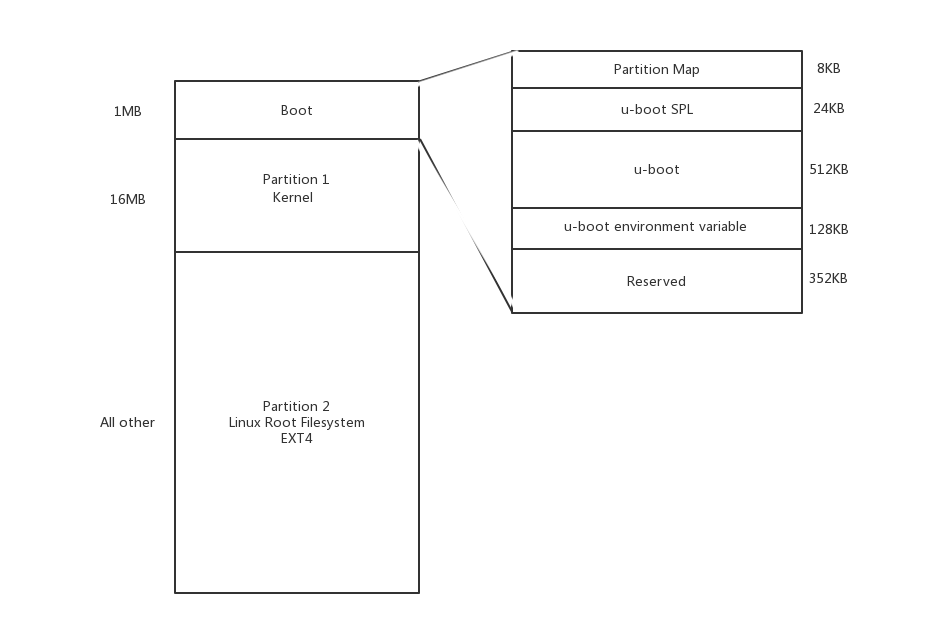

# Building a Linux image for Lichee Nano from scratch

* Build all the components directly on a mac running macOS Monterey
* No Docker or Virtual environment running Linux required

Lichee Nano is an SD Card sized Linux board powered by Allwinner F1C100s ARM9.

* 32MB DDR integrated into SoC and 16MB external SPI Flash
* 40-pin RGB LCD FPC connector supporting 272×480, 480×800, 1024×600
* SDIO for SD card or WiFi module



https://wiki.sipeed.com/hardware/en/lichee/Nano/Nano.html

# Prerequisites

* Visual Studio Code
* Install Homebrew

# Hardware Setup

## Powering and connecting the Lichee Nano

The board can be powered using the USB connector or the 5V pin. When the USB connector is in place, the SD card is not easily accessible so it's more convenient to power the board using the 5V pin. The board default UART is also needs to be connected to a UART/USB adapter. 



The UART to USB adapter is a DAPLink adapter, normally used to debug ARM using JTAG or SWD protocol but this adapter also providing UART to USB and 5V




# Software Setup

## Preparing for U-Boot and Linux Kernel build

The Linux kernel source relies on a case sensitive filesystem. Because the kernel will be built on macOS, creating a case sensitive .dmg is mandatory. 

In a Terminal window

```
$ hdiutil create -type UDIF -fs 'Case-sensitive Journaled HFS+' -size 40G -volname Lichee-Nano Lichee-Nano.dmg
```

Visual Studio Code will be used to browse or edit the Linux kernel sources and to execute scripts from the terminal. Open the created Lichee-Nano.dmg and create a directory : VSCode-LicheeNano. Create a file named "lichee-nano.code-workspace" and the ".vscode" directory

```
$ cd VSCode-LicheeNano
$ touch lichee-nano.code-workspace
```
Paste the initial workspace content below in lichee-nano.code-workspace

```
{
    "folders": [
        {
            "path": "."
        }
    ],
    "settings": {
        "git.ignoreLimitWarning": true,
        "cmake.statusbar.advanced": {
            "debug": {
                "visibility": "hidden"
            },
            "launch": {
                "visibility": "hidden"
            },
            "build": {
                "visibility": "default"
            },
            "buildTarget": {
                "visibility": "hidden"
            }
        },
        "cmake.buildBeforeRun": true,
        "cmake.configureOnOpen": false,
        "C_Cpp.autoAddFileAssociations": false
    }
}
```

## Getting the sources of U-Boot

### The Allwinner F1C100s boot sequence :

* First step, the on-chip 32KB boot ROM will try to read the program from an external storage device (first SD/MMC then SPI NAND). This is the boot0 by Allwinner, which is the SPL here. If the BROM does not successfully load this program, it will enter the USB boot mode.
* Second step, the Allwinner SPL. SPL is small and limited version of u-boot. SPL is loaded into the SRAM, and then initialize the clock, UART, DRAM and boot device (SD/MMC/SPI Flash) 
* Copy complete U-Boot from boot device to DRAM 
* Jump to full u-boot 

more details available here: https://linux-sunxi.org/BROM

U-Boot loads the kernel. U-Boot read and execute the "boot.scr" script from the first partition of the SD card. boot.scr contains three instructions: load the kernel into SDRAM, load the device tree binary into SDRAM, run the kernel.

U-Boot sources from git@github.com:Lichee-Pi/u-boot.git. The "nano-v2018.01" branch is used to build the special SPL+U-Boot version required for the Lichee Nano

```
$ git clone -b nano-v2018.01 git@github.com:Lichee-Pi/u-boot.git
```

### Requirements to build U_boot on mac

* arm-none-eabi
* Python 2.x

macOS will have python3 installed, to install another version of Python, the recommended way to do it, is to install pyenv

https://realpython.com/intro-to-pyenv/

```
$ pyenv install  2.7
$ pyenv local 2.7.18
$ pyenv which python
```

Creating a symbolic link 'python2' in /usr/local/bin to installation path returned by pyenv which 

### Building

```
$ cd u-boot
$ export CROSS_COMPILE=/usr/local/bin/arm-none-eabi-
$ make ARCH=arm licheepi_nano_defconfig
$ PYTHON=python2 make
```
## Build issues
* If libfdt was already installed on the mac, there will be a conflict when building with the version of libfdt_env.h provided with U-Boot

A temporary fix is to rename libfdt_env.h
```
$ mv /usr/local/include/libfdt_env.h /usr/local/include/libfdt_env.old
```

Build output is : u-boot-sunxi-with-spl.bin

## Getting the sources of Linux Kernel

```
git clone --single-branch --branch="nano-5.2-tf" --depth=1 https://github.com/Lichee-Pi/linux.git
```

### Requirements to build Linux Kernel on mac

* Install mac-linux-kdk

```
$ brew install spinlocklabs/mac-linux-kdk/mac-linux-kdk
```
Building

```
$ lkmake ARCH=arm CROSS_COMPILE=/usr/local/bin/arm-none-eabi- licheepi_nano_defconfig
$ lkmake ARCH=arm CROSS_COMPILE=/usr/local/bin/arm-none-eabi- -j8 all
```
## Build issues
* None

Build output is : arch/arm/boot/zImage

## Preparing an SD card with U-Boot-spl and zImage

The sd card must be formated with an 'MBR' partition scheme. 'GPT' is incompatible with the SPL. Some memory area used by GPT will be overriden by SPL and the SD card becomes unbootable.

    Offset     Function
    ======     ========
    0x00000000 MBR/partition table
    0x00002000 SPL
    0x00008000 u-boot code
    0x00088000 u-boot environment variable
    0x000A8000 reserved space
    0x00100000 start of the first partition



Command line below will create two partitions: 'FIRST' for the Kernel and 'SECOND'' partition will be used later for the Linux file system.

```
$ diskutil partitionDisk /dev/disk9 MBR fat32 FIRST 1000m fat32 SECOND 1000m
```
## Flash U_Boot+SPL
```
$ diskutil unmountDisk /dev/disk9
$ sudo dd if=u-boot/u-boot-sunxi-with-spl.bin of=/dev/disk9 bs=1024 seek=8

536+0 records in
536+0 records out
548864 bytes transferred in 0.488455 secs (1123674 bytes/sec)

```
## Adding the kernel image and dtb in the 'FIRST' partition
```
$ diskutil mount /dev/disk9s1
$ cp linux/arch/arm/boot/zImage /Volumes/FIRST/
$ cp linux/arch/arm/boot/dts/suniv-f1c100s-licheepi-nano.dtb /Volumes/FIRST/
```

## Creation the boot script

Create a boot.cmd file

```
$ touch boot.cmd
```
Paste the content below and save

```
setenv bootargs console=tty0 console=ttyS0,115200 panic=5 rootwait root=/dev/mmcblk0p2 rw
load mmc 0:1 0x80C00000 suniv-f1c100s-licheepi-nano.dtb
load mmc 0:1 0x80008000 zImage
bootz 0x80008000 - 0x80C00000
```
Generate the boot.scr using the mkimage tool built with u-boot

```
$ ./u-boot/tools/mkimage -C none -A arm -T script -d boot.cmd boot.scr
```

mkimge terminal output
```
Image Name:   
Created:      Sun Feb 12 07:11:05 2023
Image Type:   ARM Linux Script (uncompressed)
Data Size:    215 Bytes = 0.21 KiB = 0.00 MiB
Load Address: 00000000
Entry Point:  00000000
Contents:
   Image 0: 207 Bytes = 0.20 KiB = 0.00 MiB
```

```
$ cp boot.scr /Volumes/FIRST/
```

## Testing the SD card

* Unmount the SD card
```
$ diskutil unmountDisk /dev/disk9
```
* Plug the DAPLink adapter to USB but do not power the Lichee Nano yet (unplug the 5V wire from the board)
* Find the name of the serial device
```
$ ls /dev
```
* Uses the 'screen' command or 'minicom' (if installed)
```
$ screen /dev/tty.usbmodem14A01 115200
```
* Insert the SD card
* Connect the 5V wire to the board
* The board will boot up

[Boot from SD card log](MMC_BOOT.md)

The Linux Kernel will boot and fails because there is no Rootfs (minimal Linux file system) available yet.

[Next Step: build minimal rootfs](LINUX_FS.md)

